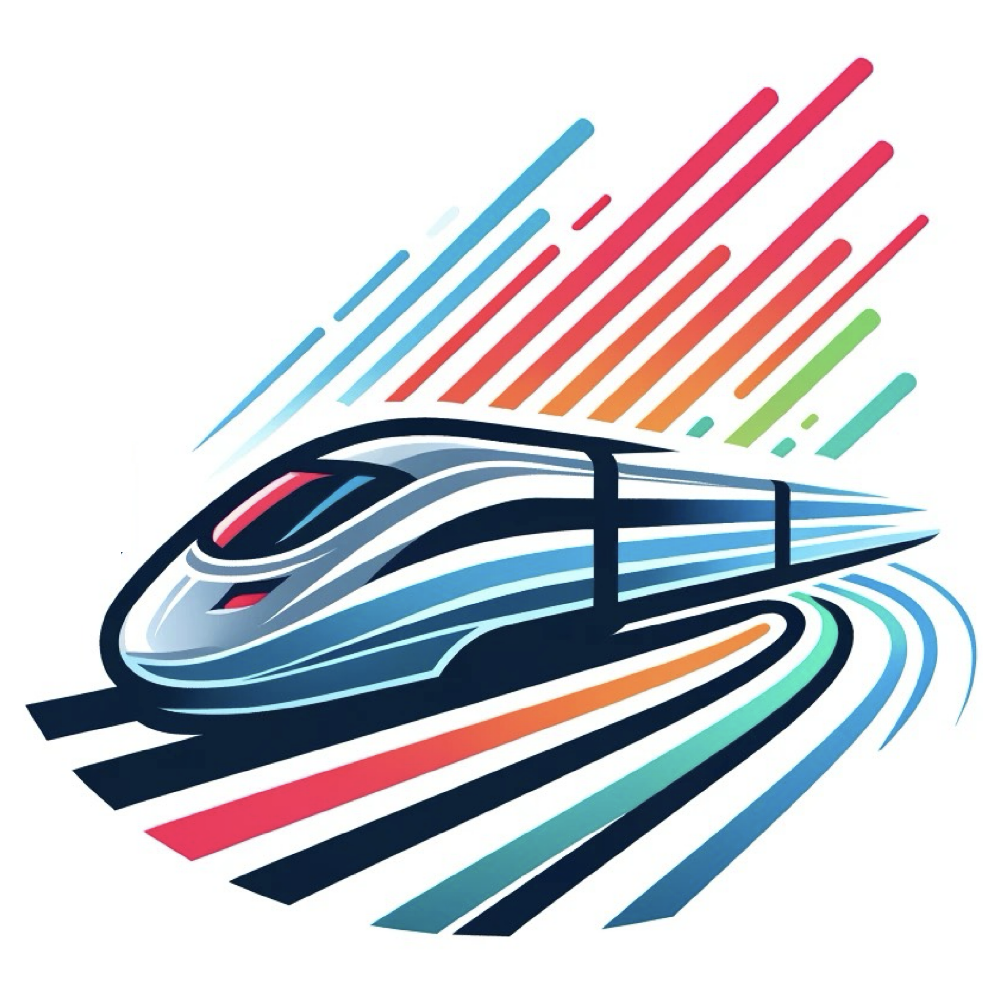

# LETS CROSSING -- Railway Crossing Simulator

<div align="center">
  
  <br>
  <strong>Enjoy railway crossings from around the world, anytime, anywhere</strong>
  <br>
  <strong>Hyper-real railway crossing sim with authentic visuals and sounds</strong>
</div>

## 📱 Application Overview

**LETS CROSSING** is a cross-platform Flutter app for Android & iOS that lets you experience and operate railway crossings from Japan, China, the UK, and the US.  
It features realistic visuals, authentic sounds, photo galleries, train illustrations, and multi-language support.

### 🎯 Key Features

- **Realistic Railway Crossing Simulation**: Authentic visuals and sounds for JP, CN, UK, US
- **Photo Gallery & Train Illustrations**: Explore real crossing photos and train images
- **Cross-platform Support**: Android & iOS compatibility
- **Multi-language Support**: Japanese, English, Chinese
- **Google Mobile Ads**: Banner ads
- **Firebase Integration**: Analytics, App Check, Vertex AI for image generation
- **Audio & Vibration Feedback**: Realistic operation feel with proper resource management
- **In-app Purchase**: One-time unlock for premium features via RevenueCat
- **AI Photo Generation**: Vertex AI integration for custom railway crossing photos

## 🚀 Technology Stack

### Frameworks & Libraries
- **Flutter**: 3.3.0+
- **Dart**: 2.18.0+
- **Firebase**: Analytics, App Check, Vertex AI
- **Google Mobile Ads**: Banner ads
- **RevenueCat**: In-app purchase management
- **Generative AI**: firebase_vertexai for photo generation

### Core Features
- **Audio**: audioplayers with stopAll functionality
- **Vibration**: vibration
- **Localization**: flutter_localizations, intl
- **Environment Variables**: flutter_dotenv
- **State Management**: hooks_riverpod, flutter_hooks
- **Permissions**: permission_handler
- **Image Save**: image_gallery_saver
- **WebView**: webview_flutter
- **UI Components**: fab_circular_menu_plus

## 📋 Prerequisites

- Flutter 3.3.0+
- Dart 2.18.0+
- Android Studio / Xcode
- Firebase project (App Check, Analytics, Vertex AI)
- RevenueCat account for in-app purchases

## 🛠️ Setup

### 1. Clone the Repository
```bash
git clone https://github.com/fcb1899v/railway_crossing.git
cd railway_crossing
```

### 2. Install Dependencies
```bash
flutter pub get
```

### 3. Environment Variables Setup
Create `assets/.env` and configure required environment variables:
```env
IOS_BANNER_UNIT_ID="your-ios-banner-id"
ANDROID_BANNER_UNIT_ID="your-android-banner-id"
OPEN_AI_API_KEY="your-openai-key"
REVENUE_CAT_IOS_API_KEY="your-revenuecat-ios-key"
REVENUE_CAT_ANDROID_API_KEY="your-revenuecat-android-key"
# Other ad IDs and secrets...
```

### 4. Firebase Configuration
1. Create a Firebase project
2. Place `google-services.json` (Android) in `android/app/`
3. Place `GoogleService-Info.plist` (iOS) in `ios/Runner/`
4. Place your Firebase service account JSON in `assets/` (if needed)
5. These files are automatically excluded by `.gitignore`

### 5. Run the Application
```bash
# Android
flutter run

# iOS
cd ios
pod install
cd ..
flutter run
```

## 🎮 Application Structure

```
lib/
├── main.dart                # Application entry point
├── homepage.dart            # Main railway crossing interface
├── menu.dart                # Purchase and settings menu
├── photo.dart               # Photo capture and gallery functionality
├── common_widget.dart       # Common widgets
├── common_function.dart     # Common functions
├── common_extension.dart    # Extension functions with comprehensive documentation
├── constant.dart            # Constant definitions
├── audio_manager.dart       # Audio management with stopAll functionality
├── purchase_manager.dart    # In-app purchase management with platform-specific handling
├── photo_manager.dart       # Photo gallery and AI generation management
├── admob_banner.dart        # Banner ad management
└── l10n/                    # Localization
    ├── app_en.arb
    ├── app_ja.arb
    ├── app_zh.arb
    ├── app_localizations.dart
    ├── app_localizations_en.dart
    ├── app_localizations_ja.dart
    └── app_localizations_zh.dart

assets/
├── images/                  # Image resources (crossings, trains, flags, etc.)
├── audios/                  # Audio files (crossing sounds, warnings, etc.)
├── fonts/                   # Font files
└── icon/                    # App icons
```

## 🎨 Customization

### Crossing Styles
- Multiple countries: Japan, China, UK, US
- Each with unique visuals, sounds, and warning patterns
- Realistic train animations and sound effects

### Visual Themes
- Realistic backgrounds and crossing equipment
- Photo galleries and train illustrations
- AI-generated railway crossing photos

### Audio Features
- Authentic warning sounds for each country
- Train passing sounds with proper looping
- Emergency sound effects
- Proper audio resource management

## 📱 Supported Platforms

- **Android**: API 21+
- **iOS**: iOS 11.0+

## 🔧 Development

### Code Analysis
```bash
flutter analyze
```

### Run Tests
```bash
flutter test
```

### Build
```bash
# Android APK
flutter build apk

# Android App Bundle
flutter build appbundle

# iOS
flutter build ios
```

## 🔒 Security

This project includes security measures to protect sensitive information:
- Environment variables for API keys
- Firebase configuration files are excluded from version control
- Ad unit IDs are stored in environment files
- Keystore files are properly excluded
- Proper audio stopping with stopAll functionality

## 📄 License

This project is licensed under the MIT License.

## 🤝 Contributing

Pull requests and issue reports are welcome.

## 📞 Support

If you have any problems or questions, please create an issue on GitHub.

## 🚀 Getting Started

For new developers:
1. Follow the setup instructions above
2. Check the application structure
3. Review the customization options
4. Start with the `main.dart` file to understand the app flow
5. Explore the comprehensive English documentation in the codebase

---

<div align="center">
  <strong>LETS CROSSING</strong> - Experience the world of railway crossings!
</div>

## Licenses & Credits

This app uses the following open-source libraries:

- Flutter (BSD 3-Clause License)
- firebase_core, firebase_analytics, firebase_app_check, firebase_vertexai (Apache License 2.0)
- google_mobile_ads (Apache License 2.0)
- shared_preferences (BSD 3-Clause License)
- flutter_dotenv (MIT License)
- audioplayers (MIT License)
- vibration (MIT License)
- hooks_riverpod, flutter_hooks (MIT License)
- url_launcher (BSD 3-Clause License)
- webview_flutter (BSD 3-Clause License)
- cupertino_icons (MIT License)
- flutter_launcher_icons (MIT License)
- flutter_native_splash (MIT License)
- intl (BSD 3-Clause License)
- flutter_localizations (BSD 3-Clause License)
- image_gallery_saver (MIT License)
- permission_handler (Apache License 2.0)
- purchases_flutter (MIT License)
- devicelocale, device_info_plus, ntp, share_plus, fab_circular_menu_plus, etc.

For details of each license, please refer to [pub.dev](https://pub.dev/) or the LICENSE file in each repository.
